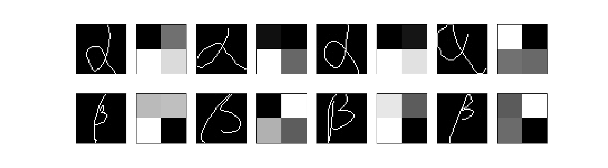
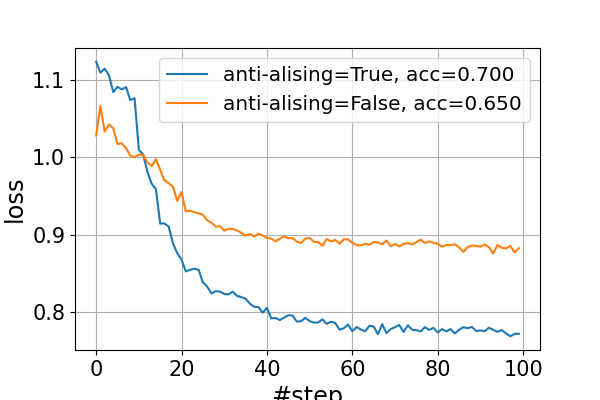
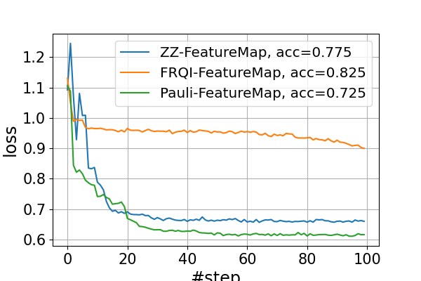
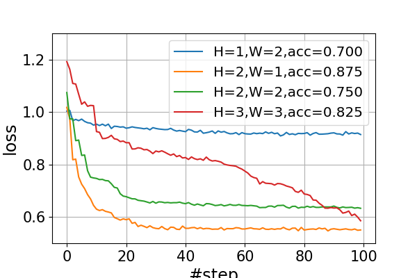

# draft20220209 summary

please use picture in folder **fig/draft20220210**

sample image with label `alpha` and `beta`

`class_size=100` (total `200` samples)

more details please check `draft20220209.ipynb`

## QSVM

| `anti_aliasing` | train-accuracy | test-accuracy |
| :-: | :-: | :-: |
| `True` | `0.962` | `0.775` |
| `False` | `0.706` | `0.55` |

conclusion: `anti_aliasing=True` is much better than `anti_aliasing=False`

---

compare `resize_image_size`

number of qubit is equal to `#qubits=height*width`. **more qubits help**

`class_size=100` (total `200` samples)

| `resize_image_size` | train-accuracy | test-accuracy |
| :-: | :-: | :-: |
| `(1,2)` | `0.669` | `0.6` |
| `(2,1)` | `0.825` | `0.75` |
| `(2,2)` | `0.956` | `0.8` |
| `(3,3)` | `1.0` | `0.925` |

## QNN

| `anti_aliasing` | train-accuracy | test-accuracy |
| :-: | :-: | :-: |
| `True` | `0.775` | `0.7` |
| `False` | `0.656` | `0.65` |

conclusion: `anti_aliasing=True` is much better than `anti_aliasing=False`

---

| `FeatureMap` | train-accuracy | test-accuracy |
| :-: | :-: | :-: |
| `ZZ` | `0.812` | `0.775` |
| `FRQI` | `0.856` | `0.825` |
| `Pauli` | `0.85` | `0.725` |

1. `FRQI` outperforms than `ZZFeatureMap/PauliFeatureMap` on this dataset
2. lower loss doesn't always mean higher accuracy

---

the number of qubits `#qubit=height*width`

| `resize_image_size` | train-accuracy | test-accuracy |
| :-: | :-: | :-: |
| `(1,2)` | `0.668` | `0.7` |
| `(2,1)` | `0.906` | `0.875` |
| `(2,2)` | `0.837` | `0.75` |
| `(3,3)` | `0.831` | `0.825` |

conclusion:
1. model with more qubits might be better
2. lower loss doesn't always mean higher accurcy
